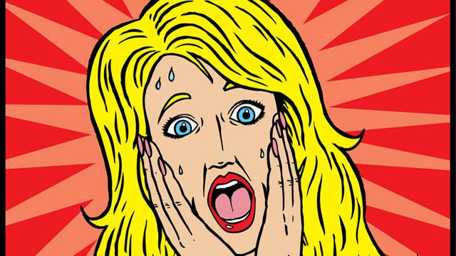
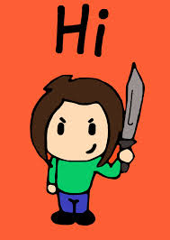
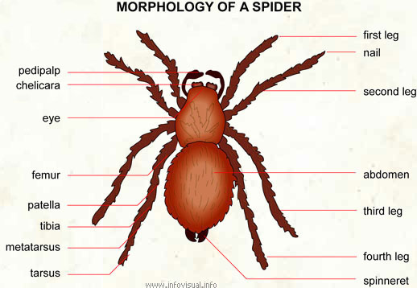

```{r include=FALSE}
require(knitr)
require(mosaic)
require(tigerstats)
require(diagram)
require(abd)
```

# Experimental Designs

## Three Common Designs

* Completely Randomized Design
* Randomized Block Design
* Repeated Measures Design

# Completely Randomized Design

## Remember ...

... in a completely randomized design, subjects are assigned to treatment groups entirely by chance.

We have seen an example (or two) already, but let's look at one more!

## Music and Reading Comprehension

Learn about a new data frame:

```{r eval=FALSE}
data(music)
View(music)
help(music)
```

Four treatment groups:

* Classical Music
* Country Music
* Rap Music
* No music at all

Subjects were randomly assigned to the groups, so this was a randomized experiment.

##  Our Research Question

*Which type of music helps (or hinders) reading comprehension the most?*

## Variable Analysis

* **type** is the explanatory variable (factor)
* **score** is the response variable (numerical)

## Practice { .practice }

How might you examine the Research Question:

* graphically?
* numerically?

## A Look at the Results

```{r eval=FALSE}
histogram(~score|type,data=music,
          main="Reading Score by Type of Music",
          breaks=seq(-0.5,10.5,by=1),
          xlab="reading score")

favstats(score~type,data=music)
```

## The graph

```{r echo=FALSE}
histogram(~score|type,data=music,
          main="Reading Score by Type of Music",
          breaks=seq(-0.5,10.5,by=1),
          xlab="reading score")
```


## Practice { .practice }

Which group had the highest reading scores, on average?

## Inferential Question

Were the differences in the average scores due to the type of music?  Or were they just due to chance variation in the random assignment of subjects to treatment groups?

(We don't know how to answer this question, yet!)

# Randomized Block Designs

## Research Question



Which will make you yell louder?

## Being Killed with a Knife?



## Or Being Killed with a Gun?


## Knife, or Gun?

A fanciful data frame:

```{r eval=FALSE}
data(knifeorgunblock)
View(knifeorgunblock)
help(knifeorgunblock)
```


## Hmm ...

... only 20 volunteers for this experiment!  (I wonder why ... .)

What if we did a completely randomized design?  Here are the subjects:

```{r eval=FALSE}
subjects <- data.frame(subjectId=LETTERS[1:20],
                       loud=knifeorgunblock$hoghollerer)
subjects
```

```{r echo=FALSE}
subjects <- data.frame(subjectId=LETTERS[1:20],
                       loud=knifeorgunblock$hoghollerer)
```

## Completely Random Assignment

Randomly assign them:

* 10 to be killed by a knife
* 10 to be killed by a gun

But notice that:

* 8 of them are hog-hollerers.  [When they yell, they yell loudly!](https://www.youtube.com/watch?v=k_rwcwU8VAg)
* 12 are not (so probably can't yell so loud)

## What Might Happen?

This code will do the random assignment, then tabulate to see how many hog-hollers got into each group:

```{r eval=FALSE}
assign <- RandomExp(subjects,sizes=c(10,10),groups=c("knife","gun"))
assign
xtabs(~treat.grp+loud,data=assign)
```


## Practice { .practice }

```{r eval=FALSE}
assign <- RandomExp(subjects,sizes=c(10,10),groups=c("knife","gun"))
assign
xtabs(~treat.grp+loud,data=assign)
```

Run the above a few times.  Are the two groups likely to be equally loud?

Is it a problem for your experiment if one group is naturally better at yelling than the other is?

## Possible Solution

Try to make both treatment groups equally good at yelling!

## The Loud Ones

* Planning groups of size 10.
* Of the 20 subjects, 8 are hog-hollerers.
* 8/20 = 4/10.
* So you would like 4 hog-hollers in each treatment group.

## The Not-So-Loud Ones

* Of the 20 subjects, 12 are NOT hog-hollerers.
* 12/20 = 6/10.
* So you would like 6 non-hog-hollers in each treatment group.

But you still need to use chance to make the specific assignments!

## Randomized Block Design

Block for the possible confounding variable:  **hoghollerer**:

* The 8 hogholleres are a "block":"
    * pick four at random to go into the "knife" group;
    * the other four go into the "gun" group.
* The 12 non-hoghollerers are another block:
    * pick six at random to go into the "knife" group;
    * the other six go into the "gun" group.
    
## Try It Out!

```{r eval=FALSE}
blockAssign <-  RandomExp(subjects,sizes=c(10,10),
                         groups=c("knife","gun"),
                         block="loud")
blockAssign
xtabs(~treat.grp+loud,data=blockAssign)
```


## The Knife or Gun Study ...

.. was a randomized block design!

```{r}
xtabs(~means+hoghollerer,data=knifeorgunblock)
```

## By the way ...

Which means of slaying results in louder yells?

```{r eval=FALSE}
densityplot(~volume,data=knifeorgunblock,
            groups=means,
            main="Yelling While Being Killed",
            xlab="Volume of dying screams (decibels)",
            auto.key=TRUE)
```

## The Graph

```{r echo=FALSE}
densityplot(~volume,data=knifeorgunblock,
            groups=means,
            main="Yelling While Being Killed",
            xlab="Volume of dying screams (decibels)",
            auto.key=TRUE)
```

Knife-slaying produces louder yells, typically!

## Also by the way ...

Which group ended up yelling louder while being killed?

```{r eval=FALSE}
densityplot(~volume|means,data=knifeorgunblock,
            groups=hoghollerer,
            main="Yelling While Being Killed",
            xlab="Volume of dying screams (decibels)",
            auto.key=TRUE,
            sub="Legend indicates whether subject was a hoghollerer")
```

## The Graph

```{r echo=FALSE}
densityplot(~volume|means,data=knifeorgunblock,
            groups=hoghollerer,
            main="Yelling While Being Killed",
            xlab="Volume of dying screams (decibels)",
            auto.key=TRUE,
            sub="Legend indicates whether subject was a hoghollerer")
```

Turns out, it was important to block for hog-hollerin'!


## When to Block

* You must have recorded the values of a potentially confounding variable
* It's most advantageous when there are not many subjects
* If you have lots of subjects, completely randomized designs are likely to do about as well!

## Matched Pairs Design

When each block has exactly two subjects, then the randomized block design is called a *matched pairs* design.

# Repeated Measures Designs

## Spider Speeds

Learn about a new data frame:

```{r eval=FALSE}
require(abd)
data(SpiderSpeed)
View(SpiderSpeed)
help(SpiderSpeed)
```

## Pedipalps



Click [here](http://www.infovisual.info/02/051_en.html) to visit the source.

## The Study

* Researchers timed each spider on a sprint, recording the speed
* then they amputated a pedipalp from each spider
* then they timed each spider on the sprint, again recording the speed.

## Repeated Measures Design

Each subject was measured twice.

The Research Question is:

* *Do Tidarren spiders run faster without one of their pedipalps?*

Notice:

* We are interested in the *difference* of two numerical variables.

## Differences

```{r eval=FALSE}
diffs <- with(SpiderSpeed,speed.after-speed.before)
densityplot(diffs,
            xlab="difference in speeds (after amp - before amp) in cm/sec",
            main="Amputating Spider Pedipalps")
```

## The Graph

```{r echo=FALSE}
diffs <- with(SpiderSpeed,speed.after-speed.before)
densityplot(diffs,
            xlab="difference in speeds (after amp - before amp) in cm/sec",
            main="Amputating Spider Pedipalps")
```

## Plus/Minus

Advantage of a repeated measures design:

* the two treatment groups are really the SAME group!

Limitation of repeated measures design:

* often you can't do it without skewing the results!

For example:

*Could you perform the knife-or-gun study as a repeated measures design?*

# Attitudes Again

## Attitudes Study Again

Let's look again at the attitudes study:

```{r eval=FALSE}
data(attitudes)
View(attitudes)
help(attitudes)
```

* read the Help File
* learn about the types of forms distributed to the subjects.

## Race and Sentence

Research Question:

Who recommends higher sentences, on average:

* subjects given a form where the defendant's suggested race is Black?
* or subjects given a form where the defendant's suggested race is White?


## Practice { .practice }

Is the data for our Research Question based on an experiment or on an observational study?

We could have asked each subject the same question twice:

* once for Tyrone Marcus Watson
* once for William Shane Winchester

Then we would have had a repeated measures design.

Why did we not do this?

