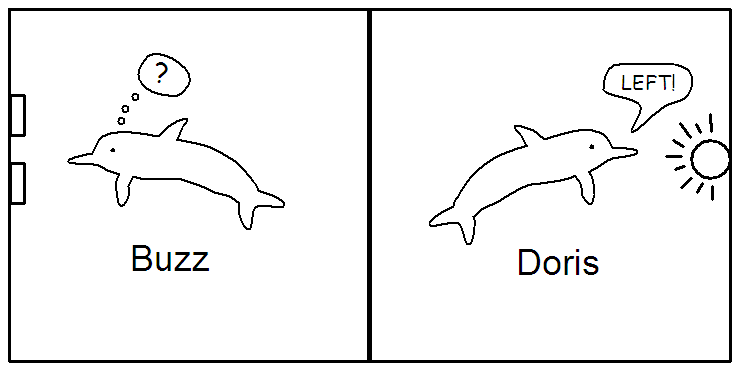

```{r include=FALSE}
require(knitr)
require(tigerstats)
```


# Dolphin Communication

## Dolphin Experiment, 1964

* A pool with two dolphins:  Doris and Buzz
* light at one end
* two buttons under the light:  Left and Right buttons
* When light flashes, push Left button to get fish treat
* When light shines steadily, push Right button to get fish treat

## Training

* Both Dolphins are trianed
* Both learn which button to push to get the treat

## The Experiment

* canvas partition down middle of pool
* dolphins cannot see through the canvas
* but they can hear through it
* Doris on one side, with only the light
* Buzz on the other side, with only the buttons

---



## Trials

* This procedure was repeated 16 times
    * light turned on (random whether it flashes or is steady)
    * Doris sees light, heads to partition, squeaks
    * Buzz heads to buttons, pushes one of them
    
Buzz pushed the correct button 15 times in the 16 tries.

## Research Question

Is this strong evidence that Doris and Buzz can communicate, to some extent?

Or was Buzz just guessing, and got lucky?

## Try It! { .practice }

* Imagine you are a dumb dolphin who can't communicate and guesses randomly.
* Each guess is like a coin flip:
    * Heads, you get a fish treat
    * Tails you don't

Flip your coin 16 times.  How many heads did you get?

## Lots of Simulations

[http://homer.shinyapps.io/CoinFlip](http://homer.shinyapps.io/CoinFlip)


## What Did You Get? { .practice }

How many times did you simulate?

What percentage of the time did you get 15 or more heads?

Suppose Buzz is just guessing:  about what's the chance that he would get 15 or more correct?

Based on your results, do you think we have strong evidence that Buzz and Doris can communicate?

## Typical Statistical Procedure

* Think of your Research Question
* Design a study to answer it.
* Collect your data ccording to your study design.
* Analyse/summarize your data.  What patterns do you see?
* Test Statistic (this time is was:  number of correct pushes in 16 tries)
* Get a P-value (chance of your test statistic or more, if Buzz is just guessing)
* Using P-value, make a judgement

    