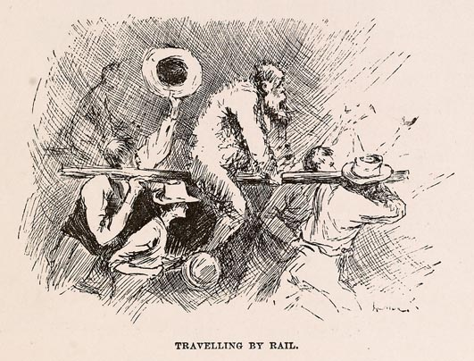

```{r include=FALSE}
library(knitr)
library(mosaic)
library(tigerstats)
```

# GAISE Report

## Gaise

* Guidelines for Assessment and Instruction in Statistics Education

* Sponsored by the ASA

* K-12 and College reports

[http://www.amstat.org/education/gaise/](http://www.amstat.org/education/gaise/)

## General GAISE Recommendations

From the GAISE Executive Summary:

* Emphasize statistical literacy and develop statistical thinking

* Use real data

* Stress conceptual understanding, rather than mere knowledge
of procedures

* Foster active learning in the classroom

* Use technology for developing conceptual understanding and
analyzing data

* Use assessments to improve and evaluate student learning

## Class Activities (GAISE App. A)

* should mimic a real-world situation (e.g., based on or lead to real data)

* class should be involved in decisions about how to conduct the activity

* their decisions should be based on what they've already learned in class

* if possible, activity should involve all phases of the statistical process:  design, collection, analysis

* teamwork can be useful

* begin and end with overview

* should be fun!

## Inference Though Simulation (GAISE App. C)

* start with a real-world situation/real data

* students perform a physical simulation

* then introduce computer technology to perform many simulations


# The Wild, Wild West

## The Wild, Wild West

You are the Sheriff of a small town in the Wild, Wild West.


## The Gambler


A gambler comes to town.  He claims to play with fair dice, but the locals in the saloon are grumbling that he wins too often.  They think his dice are "weighted."

## Investigate!

* You impound one of the gambler's dice.

* You are about to crack it open, to see if it's weighted.

* The gambler says it's his "lucky" die, and begs you not to harm it.

* So you roll it sixty times instead.

##  Your Results

In 60 rolls, you get:

Spots|Observed Count
---|---
One|8
Two|18
Three|11
Four|7
Five|9
Six|7

## Discussion Time!

* If the die were fair, what would you expect to see (give or take some for chance variation in the rolling of the die, of course)?

* What did you actually observe?

* Any suggestions on how we might determine how much evidence these 60 rolls provide against the gambler's claim that the die is fair?

## False Leads

People tend to hone in on the 18 Twos, either:

```{r eval=FALSE}
binomtestGC(18,n=60,p=1/6,alternative="greater",graph=TRUE)
```

or (if they are a bit more thoughtful):

```{r eval=FALSE}
binomtestGC(18,n=60,p=1/6,alternative="two.sided",graph=TRUE)
```

## Almost Always They Conclude ...

... ride him out of town on a rail!



## Problem

An unconscious switch from

$H_0:$  The die is fair.

$H_a:$  Nope, it's weighted.

to

$H_0:$  Chance of Two $= 1/6$

$H_a:$  Chance of Two $> 1/6$

## Data Snooping

Don't choose an inferential procedure based on a pattern that you happened to notice in your data!

## Further Discussion

What's an "even-handed" way to measure the difference between:

* the table we observed

      vs.

* the table one expects if the Die is fair?

## Chi-Square Statistic

Eventually suggest:

$$\chi^2 = \sum_{\textbf{cells}} \frac{(\textbf{observed}-\textbf{expected})^2}{\textbf{expected}}.$$

(For the class, this is an old friend.)

## Compute It

$$\chi^2 = \frac{(8-10)^2}{10}+\frac{(18-10)^2}{10}+\frac{(11-10)^2}{10} \\
+\frac{(7-10)^2}{10}+\frac{(9-10)^2}{10}+\frac{(7-10)^2}{10} \\
= 8.8$$

## What Are the Chances

Is this a "big" number?

If the die is really fair, what are the chances of getting a $\chi^2$-statistic at least as big as the one we actually got?

## Physical Simulation

Pair up:

* one person rolls 60 times
* the other tallies results
* compute the chi-square statistic

Were your results $\geq 8.8$?  What about the other students?

## Computer Simulation

* Slow at first:  one simulation at a time
* Then many at a time, keeping track of the results

Best to use an app. (Amazing how easy it is these days to write your own!)

Feel free to play along:

[http://rstudio.georgetowncollege.edu:3838/SlowGoodness](http://rstudio.georgetowncollege.edu:3838/SlowGoodness)

Or open the "Apps" drop-down menu on the Course Website:

[http://statistics.georgetowncollege.edu](http://statistics.georgetowncollege.edu)

## Assessment

Is the idea sinking in?

Students should re-use the app for a similar investigation, then write briefly about their results.

## Follow-Up:  the Canned Procedure

At first, retain connection with the simulation activity:

```{r eval=FALSE}
obs <- c(one=8,two=18,three=11,four=7,five=9,six=7)
nullProbs <- rep(1/6,times=6)
chisqtestGC(obs,p=nullProbs,
            simulate.p.value=TRUE, B=3000,
            graph=TRUE)
```

Eventually move on to "mathematical" approximation method:

```{r eval=FALSE}
chisqtestGC(obs,p=nullProbs,graph=TRUE)
```


# Further Considerations

## Our Exercise vs. GAISE Ideal

Gaise Ideal:  Use real data

Our Response:  Go against any GAISE recommendation, as long as:

* you usually heed it;

* breaking it this time will enhance instruction

* mythic elements:  Sheriff, Un-Crackable Die, ...

## Our Exercise vs. GAISE Ideal

Gaise Ideal:  Students perform a physical simulation

Our Response:  Feel free to skip ahead to computer simulation, if:

* you've done physical simulation at least once in similar previous activities

* especially if you are short on time

## Our Exercise vs. GAISE Ideal

Gaise Ideal:  Involve students in decisions on methods

Our Response:

In this case, can comply fully only if

* students have the ability to code their suggested routine on the spot, or

* you can tweak the app so that YOU can implement any viable suggested routine, on the spot

(The latter is quite possible in the R Studio environment!)

## Our Exercise vs. GAISE Ideal

Gaise Ideal:  Stress inferential concepts over inferential procedures (e.g., canned "chi-square test")

Our Response:

* in compliance, here

* with a plus:  our procedures have built-in options to preserve the conceptual link with the learning activity that led to them!

## Our Exercise vs. GAISE Ideal

Gaise Ideal:  Assess the activity

Our Response:

* Easy to do with R Markdown "lab" sheets

* automatic collection at end of class period

Added Benefit:

* daily R Markdown sheets prepare students for genuine data analysis reports

# R Studio Environment


